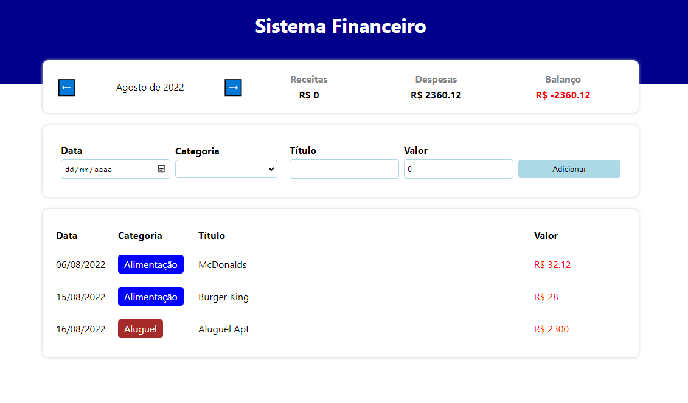

# Expense-tracker

  

## 💻 Projeto

Esta aplicação é fruto do Bootcamp TQI Fullstack Developer, bootcamp promovido pela TQI e pela Digital Innovation One. Neste projeto, foi requisitado a criação de uma
aplicação em React que utilizasse os conceitos e ferramentas apresentados no Bootcamp, como: react hooks, componentização da aplicação e styled components. Para tanto, foi desenvolvida uma SPA de controle financeiro para cadastro de gastos e receitas.

## ⚡ Funcionalidades

Principais funcionalidades da aplicação:
- Cadastro de data do lançamento;
- Cadastro de categoria do lançamento;
- Cadastro de título do lançamento;
- Cadastro de valor do lançamento;
- Display com resumo das informações;
- Filtros para o lançamentos;
- Display com lançamentos filtrados;

## 🚀 Tecnologias

Principais tecnologias utilizadas no projeto:
- Linguagem JavaScript;
- TypeScript;
- React;
- Styled Components.
